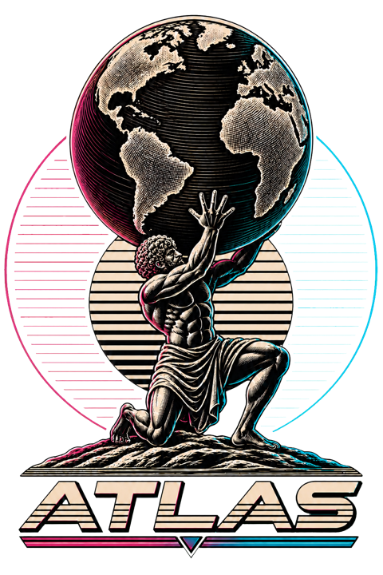
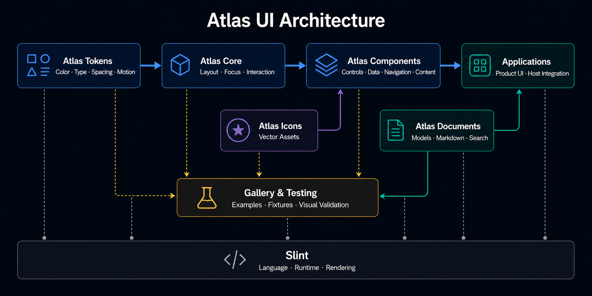

<p align="center">
  
</p>

<h1 align="center">Atlas UI</h1>

<p align="center">
  <a href="https://github.com/0xrariux/Atlas-UI/actions/workflows/ci.yml"></a>
  <a href="LICENSE"></a>
  <a href="https://www.rust-lang.org"></a>
  <a href="https://github.com/slint-ui/slint"></a>
  <a href="https://github.com/0xrariux/Atlas-UI/releases/tag/v0.1.1"></a>
</p>

> [!WARNING]
> **Atlas UI is experimental, work in progress, and provided as is.** The project
> is actively maintained, but APIs, component behavior, platform support, and
> rendered output may still change or contain defects. Validate Atlas against
> your target platform and requirements before using it in production.

<p align="center"><strong>Powered by <a href="https://github.com/slint-ui/slint">Slint</a></strong></p>

<p align="center"><sub><strong>AI-agent friendly</strong> · Structured manifests, documented contracts, and deterministic validation for human–AI collaboration. <a href="docs/AI_INTEGRATION_GUIDE.md">Agent guide</a></sub></p>

Atlas UI is a native component library and visual foundation for **Rust and
Slint**. It gives Slint an industrialized layer comparable to mature web design
systems and frontend libraries: tokens, a grid, coherent components, responsive
compositions, templates, a gallery, and deterministic visual validation.

Atlas does not replace Slint. Slint provides the declarative language, runtime,
native rendering, and low-level interactions; Atlas provides the conventions,
contracts, and reusable catalog built on top of it.

## Complete application templates

The companion [`template-atlas`](https://github.com/0xrariux/template-atlas)
repository contains four cloneable, native Rust + Slint applications built on
Atlas. Its README includes rendered previews and commands for running each
template locally. Each template pins the published `atlas-ui` `0.1.1` crate,
so consumers can clone that repository without a sibling Atlas source checkout.

| Template | Demonstrated application surface |
|---|---|
| Command | Operations, analytics, services, alerts, and administration |
| Forge | Code-oriented engineering workspace, explorer, and inspector |
| Fleet | Infrastructure, telemetry, deployments, and incident control |
| Ledger | Portfolio, assets, transactions, markets, and treasury settings |

These applications provide realistic integration and visual-validation
evidence without moving product-specific composition or art direction into
Atlas's reusable library primitives. Browse the
[template gallery](https://github.com/0xrariux/template-atlas#preview) or clone
the companion repository when starting a complete application. Atlas upgrades
can validate all four external consumer suites and their 97 rendered states
with the documented [external consumer gate](docs/EXTERNAL_CONSUMER_SCENARIOS.md).

> [!IMPORTANT]
> **For coding agents, a Cargo path to Atlas is not enough to reproduce a good
> interface.** Give the agent Atlas's API context, an explicit product reference,
> target viewport sizes, and require screenshot-based iteration. See the
> [visual workflow for coding agents](docs/AGENT_VISUAL_WORKFLOW.md) for an
> external-project setup, a consumer `AGENTS.md` snippet, and a reusable prompt.

## Vision

Atlas aims to give Rust and Slint applications a systematic visual-development
foundation: shared design decisions, reusable interface contracts, and
composable building blocks that remain coherent as products grow. Slint stays
the language and rendering foundation; Atlas organizes its primitives into a
consistent system for building distinctive interfaces repeatedly and at scale.

The goal is to make a modern interface an engineering outcome rather than a
collection of one-off styling decisions. Shared tokens define color,
typography, spacing, density, motion, and geometry. Components encode reusable
interaction and accessibility contracts. Responsive compositions and templates
provide reliable starting structures, while deterministic fixtures and visual
validation keep the result consistent as an application evolves.

Atlas is therefore designed for teams and individual developers who want to
produce generic but distinctive application surfaces that are elegant,
readable, responsive, and production-ready. Applications keep control of their
identity and domain behavior, while Atlas supplies the visual grammar and
industrial foundations needed to avoid rebuilding the same UI rules on every
screen or in every Rust project.



## Project status

- current release: `v0.1.1`;
- referenced Slint version: `1.17.1`;
- continuous integration: Linux, Windows, and macOS with Rust `1.92`;
- deterministic visual profile: macOS arm64, software renderer, scale factor 1;
- 97 public components (26 stable and 71 preview),
  180 public symbols (58 stable and 122 preview), and 38 registered icons;
- 77 deterministic visual scenarios across 32 pages;
- four external template consumer suites covering 97 rendered application
  states;
- MIT license.

This release includes a stable standalone status indicator and preview
composition primitives for a controlled vertical scrollbar, settings rows,
chart frames, unframed metrics, copyable values, and slotted modal and drawer
content. It also makes progress tracks and switch anatomy configurable. These
are library-level presentation and interaction contracts: applications still
own data, persistence, chart series, clipboard access, feedback timing, and
every other external effect.

Import stable contracts from `stable.slint`. Use `preview-nonresponsive.slint`
for evolving controls that do not need experimental layout. The full
`preview.slint` and `components.slint` compatibility aggregates load responsive
contracts and require `SLINT_ENABLE_EXPERIMENTAL_FEATURES=1`.

```slint
import { AtlasButton, AtlasTextField, AtlasTheme }
    from "@atlas-ui/stable.slint";
```

```slint
import { AtlasProgressBar, AtlasScrollbar, AtlasTab }
    from "@atlas-ui/preview-nonresponsive.slint";
```

For vertical overflow, prefer `AtlasScrollViewport` when Atlas can own native
flicking and keyboard paging. Use `AtlasScrollbar` when an existing list,
flickable, or host-controlled surface already owns content movement and needs
the Atlas rail, thumb, and pointer-target contract.

## When to use Atlas

Atlas is a suitable foundation when a Rust and Slint application needs shared
design tokens, reusable native components, consistent themes and density,
responsive compositions, accessible interaction contracts, or application
templates that can evolve across multiple screens.

Atlas may not be the appropriate choice when an application only needs a small
interface built from Slint's standard widgets, requires a production-stable API
across the complete catalog today, needs DOM or CSS components, cannot use the
pinned Slint version, or targets a platform and renderer that Atlas has not yet
validated. Preview components require explicit acceptance of minor-version API
changes.

## Documentation

- [Overview and scope](docs/OVERVIEW.md)
- [Public roadmap](ROADMAP.md)
- [Technology and upstream watchlist](TECHNOLOGY_WATCHLIST.md)
- [Binary efficiency and dead-code policy](docs/BINARY_EFFICIENCY.md)
- [Architecture and layers](docs/ARCHITECTURE.md)
- [Slint relationship and version tracking](docs/SLINT_INTEGRATION.md)
- [Component catalog](docs/COMPONENTS.md)
- [Component index for AI agents](docs/AGENT_COMPONENT_INDEX.md)
- [Integration guide for AI agents](docs/AI_INTEGRATION_GUIDE.md)
- [Visual workflow for coding agents](docs/AGENT_VISUAL_WORKFLOW.md)
- [External consumer scenarios](docs/EXTERNAL_CONSUMER_SCENARIOS.md)
- [Quickstart for coding agents](docs/AGENT_QUICKSTART.md)
- [Machine-readable API manifest guide](docs/AGENT_MANIFEST.md)
- [Native Rust tooling](docs/TOOLING.md)
- [Compatibility matrix](docs/COMPATIBILITY.md)
- [Distribution and registry preparation](docs/DISTRIBUTION.md)
- [Agent evaluation kit](evals/agent-discovery/README.md)
- [Publication boundary and language policy](docs/PUBLICATION_POLICY.md)
- [Engineering, quality, and contribution](docs/ENGINEERING.md)
- [Getting started](GETTING_STARTED.md)

The `docs/` directory is the public documentation. Internal planning records
are not part of the GitHub distribution.

English is the project's official and only language for source code, interface
copy, documentation, issue templates, and contribution material.

## Project positioning

The following table describes Atlas by technical category.

| Category | Atlas position |
|---|---|
| Project type | Native visual foundation, design system, and component library for Rust applications using Slint |
| Primary role | Standardize visual decisions and reusable interface contracts across screens and applications |
| Rendering foundation | Uses Slint for its declarative UI language, runtime, rendering, layout, properties, and local interaction |
| Rust responsibility | Domain models, navigation, persistence, networking, filesystem access, security decisions, and other external effects |
| Slint responsibility | Presentation, component composition, rendering, local state, focus, and animations |
| Visual system | Semantic color, typography, spacing, density, geometry, elevation, and motion tokens |
| UI scope | Foundations, controls, data presentation, navigation, overlays, editorial content, documentation surfaces, responsive compositions, and application templates |
| Component behavior | Controlled properties and callbacks express intentions; components do not perform hidden I/O or domain mutations |
| Customization model | Shared tokens, public component properties, composition, and host-provided data and actions |
| API organization | `stable.slint` contains SemVer-governed contracts; `preview-nonresponsive.slint` exposes evolving APIs without experimental layout; `preview.slint` and `components.slint` are responsive compatibility aggregates |
| Distribution model | Workspace crates and Slint import facades consumed as shared dependencies rather than copied component source |
| Reuse level | Designed for shared use across multiple screens and applications while leaving product-specific behavior in the host |
| Documentation model | Public architecture, component catalog, agent manifest, integration guide, compiled consumer example, and executable native gallery |
| Validation model | Automated architecture and API checks, deterministic fixtures, visual scenarios, contrast and accessibility contracts, and performance budgets |
| Accessibility scope | Keyboard, focus, semantics, contrast, reduced motion, and explicit host-controlled interaction contracts are part of component validation |
| Current API size | 97 public components, 58 stable symbols, and 122 preview symbols in Atlas `v0.1.1` |
| Platform validation | Linux, Windows, and macOS continuously compile and pass Clippy, tests, and public contract checks; deterministic rendering evidence currently covers macOS arm64 with Slint's software renderer at scale factor 1 |
| Maturity | Experimental and work in progress, actively maintained, with stable and preview surfaces separated explicitly |
| License | Atlas source is MIT licensed; Slint and third-party assets retain their own license terms |

## Installation and local development

Atlas `0.1.1` is published on crates.io, with the matching `v0.1.1` GitHub tag
as its source snapshot. Add the facade as both a runtime and build dependency
so its helper can expose portable named Slint imports:

```toml
[dependencies]
atlas-ui = "=0.1.1"
slint = "=1.17.1"

[build-dependencies]
atlas-ui = "=0.1.1"
slint-build = "=1.17.1"
```

The stable and non-responsive preview facades compile without Slint
experimental features. Applications importing `preview.slint` or
`components.slint` must enable their responsive contracts explicitly:

```toml
# .cargo/config.toml
[env]
SLINT_ENABLE_EXPERIMENTAL_FEATURES = "1"
```

The effective Rust MSRV is `1.92`, as required by `slint-build 1.17.1`.

For repository development, use the workspace commands below.

```bash
cargo check -p atlas-ui-getting-started
cargo run -p atlas-ui-gallery
```

Run the complete validation suite with:

```bash
sh scripts/quality-gate.sh
```

It covers formatting, compilation, Clippy, tests, architecture, API contracts,
contrast, automated accessibility, budgets, assets, and visual scenarios.

## Feedback and issues

Feedback from real applications is valuable, especially for rendering defects,
platform differences, accessibility problems, API friction, missing states, and
components that do not behave well with realistic content.

Use the [structured issue forms](https://github.com/0xrariux/Atlas-UI/issues/new/choose) to report a problem or
propose an improvement. A useful report should identify the affected component,
Atlas and Slint versions, operating system, architecture, renderer, theme,
density, viewport or window size, reproduction steps, expected result, and
actual result. Include a minimal reproduction and screenshots when possible,
but remove secrets and personal data first.

Before opening a report:

1. Search existing issues for the same behavior.
2. Confirm whether the component comes from `stable.slint`,
   `preview-nonresponsive.slint`, or the responsive `preview.slint` aggregate.
3. Reproduce the problem with the smallest practical example.
4. Note whether it is a regression and, if known, the last working version.
5. Separate observable facts from design preferences or proposed solutions.

See [Contributing feedback](CONTRIBUTING.md) for the complete reporting and
triage expectations.

## License

Atlas UI is distributed under the [MIT License](LICENSE). Slint, fonts, and
third-party assets retain their respective licenses.
