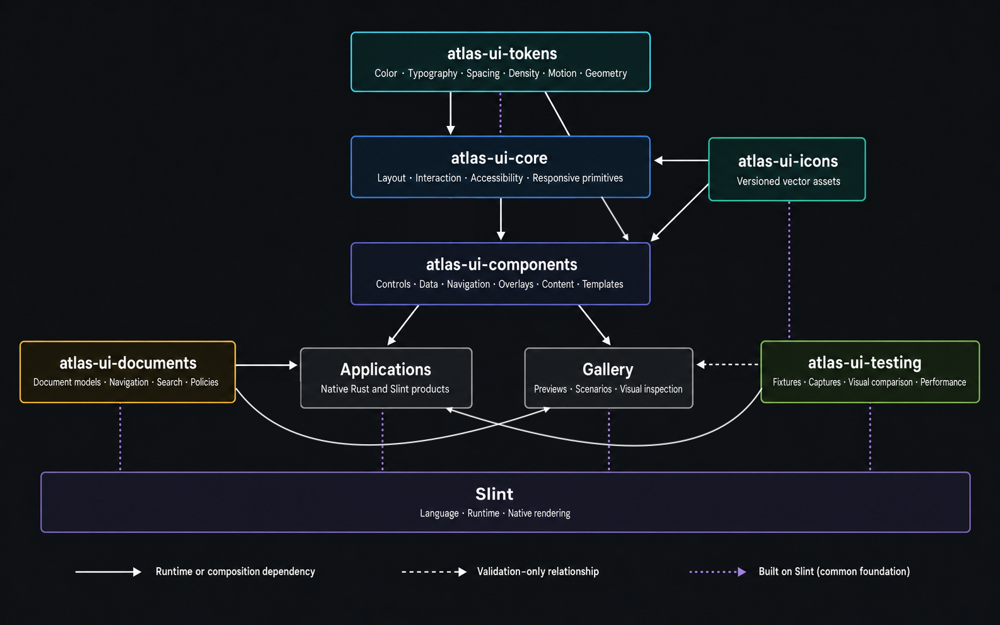

# Architecture and layers

Atlas is a Rust workspace divided by responsibility. A lower layer never
depends on a higher layer, and dependency cycles are forbidden.

## 1. Tokens — `atlas-ui-tokens`

The first layer contains atomic visual decisions: semantic palette, themes, a
4 px grid, spacing, sizes, typography, densities, elevation, shapes, motion,
viewports, and z-order. Higher-level components do not introduce arbitrary
colors or dimensions.

## 2. Core — `atlas-ui-core`

Core turns tokens into geometric and behavioral primitives: surfaces, content
frames, focus, grids, scrolling, intrinsic layouts, split views, and headless
controllers. This layer has no domain knowledge.

## 3. Icons — `atlas-ui-icons`

This crate owns the icon registry, deterministic SVGs, sizes, and semantic
tones. Assets are checksum-controlled and separate from typography. Original
icons are licensed under CC0-1.0.

## 4. Components — `atlas-ui-components`

This layer composes tokens, core, and icons into the user-facing API. It
contains controls, navigation, data presentation, editorial content,
documentation, and templates. Three facades define the contract:

- `stable.slint`: 48 symbols guaranteed by SemVer;
- `preview.slint`: 110 evolving symbols;
- `components.slint`: compatibility aggregate.

## 5. Documents — `atlas-ui-documents`

This Rust crate remains independent of Slint. It provides document models, safe
Markdown, Unicode anchors, history, search, destination policies, asynchronous
loading, and selection controllers. It selects no runtime and performs no I/O.

## 6. Testing — `atlas-ui-testing`

Large fixtures, image comparators, and measurement tools live outside the
public runtime. They support the gallery and quality gate without burdening
consumer applications.

## 7. Gallery — `apps/gallery`

The gallery is executable native documentation. Every scenario has an
identifier, fixture, viewport, metadata, and baseline. It serves as a catalog,
stress test, and visual-regression infrastructure.

## Rust/Slint boundary

Slint owns rendering, declarative composition, local focus, and animations.
Rust owns models, computation, loading, security, and external effects. Atlas
callbacks are intentions that the host validates and returns as controlled state.
